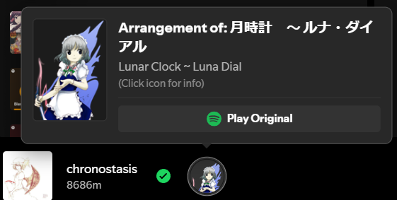

# ⛩️ TohoInfo - Spicetify Extension



## 🌟 Overview

TohoInfo is a lightweight Spicetify extension designed for fans of the Touhou Project music scene. It automatically identifies if the song currently playing on Spotify is an arrangement of a ZUN original and provides immediate, persistent metadata.

## ✨ Features

* **Arrangement Detection:** Uses title and album matching against the external TouhouDB API to identify arrangements, with intelligent handling of secondary artists and arrangement suffixes.
* **Persistent Visual Display:** Displays a larger icon (64x64px) in the player bar showing either the associated character image or album artwork if no character is available.
* **Rich Metadata Card:** Hovering the icon reveals a full information card including:
  * Original song title (Japanese)
  * English translation
  * Game/Album title (e.g., "Touhou 7 ~ Perfect Cherry Blossom")
  * Associated character name or stage information
* **Character Priority:** Shows character names (e.g., "Reimu", "Marisa") when available, with stage information as fallback.
* **Fast Spotify Link:** Provides a one-click button in the hover card to jump directly to the original ZUN track on Spotify.
* **TouhouDB Integration:** Clicking the icon opens the song's TouhouDB page in an in-app browser window.
* **Smart Fallback Images:** Uses character artwork when available, falls back to album cover art otherwise.
* **Hardcoded Fallback:** Uses a local database for crucial ZUN track links, ensuring the "Play Original" button is highly reliable.

## 💾 Installation

### Prerequisites
1.  [Spicetify CLI](https://spicetify.app/docs/getting-started/installation) installed and working.
2.  Node.js installed (for building the file).

### Steps
1.  **Place the File:** Place the compiled `tohoinfo.js` file into your Spicetify extensions folder:
    * `~/.config/spicetify/Extensions/` (Linux/macOS)
    * `%appdata%\spicetify\Extensions\` (Windows)

2.  **Enable the Extension:** Open your terminal and run:
    ```bash
    spicetify config extensions tohoinfo.js
    ```

3.  **Apply Changes:**
    ```bash
    spicetify apply
    ```

## 🎵 How It Works

When a song starts playing:

1. TohoInfo cleans the title by removing arrangement markers (VIOLIN ROCK, etc.) and stage boss descriptions
2. It searches TouhouDB for the cleaned title
3. If an arrangement is found, it fetches the original song's metadata including:
   - Character information (if the original song is a character theme)
   - Album/game information (e.g., "Touhou 12 ~ Unidentified Fantastical Object")
   - Stage information (if not a character theme)
4. The hover card displays this metadata with appropriate imagery

## 🛠️ Development & Building

If you are using the repository's source code, you must first install dependencies and build the TypeScript files:

```bash
# Inside your project folder
npm install
npm run build
```

To build with minification:
```bash
npm run build-local
